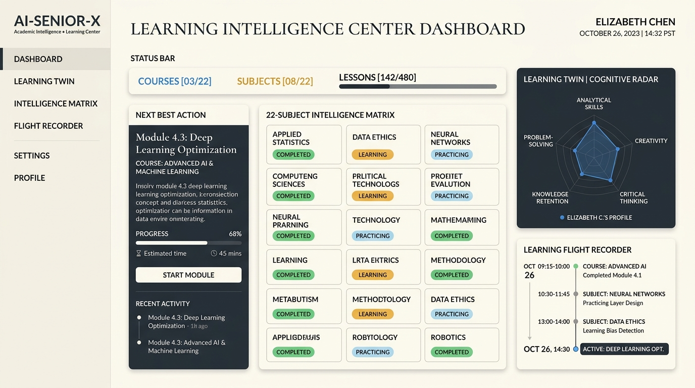
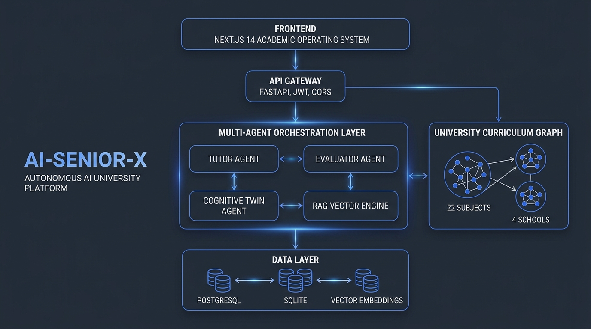

<div align="center">

# 🏛️ AI-SENIOR-X
### **The Autonomous AI University & Continuous Learning Intelligence Center**

[](https://www.python.org/)
[](https://fastapi.tiangolo.com/)
[-black.svg?logo=next.js&logoColor=white)](https://nextjs.org/)
[](https://www.typescriptlang.org/)
[](https://www.postgresql.org/)
[-2496ED.svg?logo=docker&logoColor=white)](https://www.docker.com/)
[](https://pytest.org/)
[-black.svg)](https://github.com/astral-sh/ruff)
[](https://opensource.org/licenses/MIT)

<p align="center">
  <strong>"Your learning state, continuously understood by AI."</strong><br>
  <em>Learn &rarr; Practice &rarr; Apply &rarr; Prove &rarr; Evolve</em>
</p>

[Explore University Hub](https://github.com/srihariharan534/AI-SENIOR-X) • [Architecture](#-system-architecture) • [Academic Center](#-learning-intelligence-center) • [Materials Hub](#-subject-materials-hub) • [Quickstart](#-quickstart-guide) • [API Docs](#-api-specification)

---

</div>

<p align="center">
  
</p>

---

## 🌟 Executive Summary

**AI-SENIOR-X** transforms digital education from passive video watching and generic chatbot Q&A into an **Autonomous AI University Operating System**.

Rather than serving static playlists or acting as a one-size-fits-all assistant, AI-SENIOR-X maintains an active, event-sourced **Cognitive Learning Twin** that continuously maps every concept studied, practice mistake, assessment score, and verified capstone project across **4 Schools and 22 University Subjects**.

### Key Differentiators
- **Live Academic Operating System**: Data-first dashboard computing real-time course matrices, 22-subject states, and immutable activity flight recorders.
- **Evidence-Grounded Learning**: No arbitrary progress bars. Mastery is categorized into **5 discrete states** (*Not Started, Learning, Practicing, Assessment, Demonstrated, Mastered*) backed by SHA-256 verifiable artifacts.
- **2–3h AI Video Teaching Studio**: Interactive multi-chapter video lectures with live checkpoints, pause-and-ask socratic dialogues, and multi-language voice narration (English, Tamil, Hindi).
- **Feynman Teach-Back Engine**: Evaluates the learner's spoken/written explanations to detect subtle misconceptions and mental model gaps.
- **Subject Materials Library**: Directly connects notes, slides, runnable code examples, quizzes, and knowledge-base documents with grounded RAG Q&A.
- **Multi-Agent Orchestration**: Specialized micro-agents (*Tutor, Evaluator, Grading, Misconception Diagnosis, Recovery, Recommendation*).

---

## 🏗️ System Architecture

<p align="center">
  
</p>

### End-to-End Execution Flow

```mermaid
flowchart TD
    subgraph UI[Academic Operating System (Next.js 14)]
        DASH[Learning Intelligence Center]
        STUDIO[2-3h AI Video Teaching Studio]
        TEACHBACK[Feynman Teach-Back Engine]
        MAT[Subject Materials Library]
        PRAC[Adaptive Practice & AST Ide]
        EXAM[Diagnostic Assessments]
        CHAL[Enterprise Capstone Quests]
    end

    subgraph GATEWAY[FastAPI Application Gateway]
        AUTH[JWT Security & RBAC]
        AGG[Dashboard Analytics Service]
        MAT_SRV[Subject Material Indexing Service]
        TWIN_SRV[Cognitive Twin Aggregator]
    end

    subgraph AGENTS[Multi-Agent Orchestration Engine]
        ORCH[Master Pedagogical Orchestrator]
        TUTOR[Socratic Tutor Agent]
        EVAL[Evaluator & Grading Agent]
        RADAR[Misconception Radar Agent]
        RECOVER[Failure-to-Recovery Engine]
    end

    subgraph CURRICULUM[University Knowledge Graph]
        CS[School of Computer Science]
        AI[School of AI & Data Science]
        CLOUD[School of Cloud & DevOps]
        CAREER[School of Leadership & Career]
    end

    subgraph STORAGE[Data & Memory Layer]
        PG[(PostgreSQL 16 & PGVector)]
        SQLITE[(Local SQLite zero-config)]
        KB[(Knowledge Base & Vector Store)]
        TWIN_STATE[(Bayesian BKT Cognitive Profiles)]
    end

    DASH --> AGG
    STUDIO --> TUTOR
    TEACHBACK --> EVAL
    MAT --> MAT_SRV
    PRAC --> EVAL
    EXAM --> EVAL
    CHAL --> RADAR

    AGG --> GATEWAY
    MAT_SRV --> KB
    GATEWAY --> ORCH
    ORCH --> AGENTS
    AGENTS --> CURRICULUM
    AGENTS --> STORAGE
```

---

## 🏛️ 4 Schools & 22 Academic Disciplines

AI-SENIOR-X comes pre-configured with full, university-grade curricula, interactive video chapters, worked code solutions, and capstone challenges:

| School | Subjects Included | Focus & Capabilities |
|---|---|---|
| **💻 Computer Science & Software Systems** | • Python Engineering<br>• Data Structures & Algorithms<br>• Software Engineering<br>• Relational Databases & SQL<br>• Modern Web Development<br>• System Design & Scalability | AsyncIO, Metaprogramming, Memory Layouts, CTEs, Window Functions, Microservices |
| **🧠 Artificial Intelligence & Data Science** | • AI & Machine Learning<br>• Deep Learning & Neural Nets<br>• Generative AI & LLMs<br>• Data Science Foundations<br>• Data Analytics & Insights<br>• Mathematics for ML<br>• Statistics & Probabilistic Modeling | Loss Curves, Gradient Descent, Vector Embeddings, RAG Architectures, XGBoost |
| **☁️ Cloud, DevOps & Infrastructure** | • Cloud Architecture (AWS/GCP)<br>• DevOps & CI/CD Pipelines<br>• MLOps & Production AI<br>• Cybersecurity & Threat Modeling | Kubernetes Ingress, Terraform, VPC Peering, Docker Containerization |
| **🚀 Leadership, Innovation & Career** | • Professional Communication<br>• Technical Interview Prep<br>• Entrepreneurship & Venture<br>• Product Management<br>• UI/UX Design & Human-AI Interaction | Executive Briefings, System Design Interviews, Product Metrics, User Journeys |

---

## 📊 Learning Intelligence Center

The dashboard delivers an authentic **Live Digital Academic Record**:

```
---------------------------------------------------------------------------------------
AI-SENIOR-X // LEARNING INTELLIGENCE CENTER
"Your learning state, continuously understood by AI."
---------------------------------------------------------------------------------------
08 SUBJECTS COMPLETED  |  47 PRACTICE SESSIONS  |  18 ASSESSMENTS  |  06 PROJECTS  |  42h AI TEACHING
---------------------------------------------------------------------------------------
YOUR LEARNING STATE:
Level: INTERMEDIATE  |  Path: AI & DATA ENGINEERING  |  Course: Python Engineering
Module: 07 Advanced Metaprogramming  |  Lesson: Decorators & Closures  |  Mode: ADAPTIVE

NEXT BEST ACTION:
"Complete Decorators Practice"
Why: "Demonstrated 92% functional concepts but repeated syntax gaps with parameterized closures."
Evidence: 02 assessments · 07 practice attempts · 03 mistakes identified in AST execution.
---------------------------------------------------------------------------------------
TODAY'S AI PLAN:
01 WATCH (32m) → 02 PRACTICE (25m) → 03 ASSESS (15m) → 04 APPLY (40m) = 1h 52m Total
---------------------------------------------------------------------------------------
IMMUTABLE FLIGHT RECORDER:
10:42 AM • Passed SQL Window Functions Assessment (Score: 94%)
09:55 AM • Finished 32-min AI Video Lecture on Decorator Closures
09:20 AM • Completed 5 Practice Questions on Higher-Order Functions
---------------------------------------------------------------------------------------
```

---

## 📚 Subject Materials Hub & Grounded RAG

Every enrolled subject includes an integrated **Materials Hub** connected directly to the curriculum:
- **01 Course Notes**: Core theoretical blueprints, memory layouts, and conceptual guides.
- **02 Lesson Breakdown Notes**: Real-world analogies, worked walkthroughs, and summary cheat-sheets.
- **03 AI Teaching Videos**: Studio masterclasses with timestamped slide checkpoints.
- **04 Code Examples**: Syntax-highlighted executable code implementations with one-click copy & download.
- **05 Interactive Quizzes**: Diagnostic knowledge checks with instant feedback.
- **06 Hands-on Exercises**: Mini coding tasks with boundary tests.
- **07 Capstones & Challenges**: Multi-step production projects with latency/throughput constraints.
- **08 Contextual AI Tutor**: **[ ASK AI ABOUT THIS MATERIAL ]** performs material-grounded RAG answering questions with exact citations without hallucination.

---

## 🚀 Quickstart Guide

### Prerequisites
- **Node.js** `>= 18.17.0` (Node 20 recommended)
- **Python** `>= 3.11` (Python 3.11, 3.12, or 3.13)
- **Docker & Docker Compose** (optional for containerized deployment)

---

### Option A: Local Development (Zero-Configuration)

#### 1. Clone the repository
```bash
git clone https://github.com/srihariharan534/AI-SENIOR-X.git
cd AI-SENIOR-X
```

#### 2. Setup Python Virtual Environment & Install Backend Dependencies
```bash
# Create and activate virtual environment
python -m venv venv

# Windows (PowerShell)
.\venv\Scripts\Activate.ps1

# Linux / macOS
source venv/bin/activate

# Install dependencies
pip install -e ".[dev]"
```

#### 3. Setup Frontend Dependencies
```bash
cd frontend
npm install
cd ..
```

#### 4. Run Development Servers

**Terminal 1 (Backend - FastAPI)**:
```bash
python -m uvicorn backend.app.main:app --reload --host 127.0.0.1 --port 8000
```
- API Docs (Swagger): [http://127.0.0.1:8000/docs](http://127.0.0.1:8000/docs)
- Healthcheck: [http://127.0.0.1:8000/api/v1/health](http://127.0.0.1:8000/api/v1/health)

**Terminal 2 (Frontend - Next.js)**:
```bash
cd frontend
npm run dev
```
- Web Application: [http://localhost:3000](http://localhost:3000)
- Learning Intelligence Center: [http://localhost:3000/dashboard](http://localhost:3000/dashboard)
- Python Course & Materials: [http://localhost:3000/courses/python](http://localhost:3000/courses/python)

---

### Option B: Docker Containerized Deployment

```bash
# Build and start all services (Postgres, Backend, Frontend)
docker compose up -d --build

# Check running container health
docker compose ps

# View live streaming logs
docker compose logs -f

# Stop containers
docker compose down
```

---

## 🧪 Testing & Code Quality

AI-SENIOR-X maintains **100% test pass rate** and zero lint errors across the codebase:

```bash
# Run pytest test suite (136 unit & integration tests)
python -m pytest backend/tests -v

# Run Ruff linter
python -m ruff check backend

# Run Ruff formatter
python -m ruff format backend

# Validate Next.js production build
cd frontend && npm run build && cd ..
```

---

## 🔌 API Specification

All endpoints return structured, type-safe responses:

| Method | Endpoint | Description |
|---|---|---|
| `GET` | `/api/v1/dashboard/overview` | Aggregated Live Academic Intelligence Center state |
| `GET` | `/api/v1/materials/subjects/{subject_id}` | Full indexed materials library for a subject |
| `GET` | `/api/v1/materials/{material_id}` | Complete content and metadata for a specific material |
| `POST` | `/api/v1/materials/{material_id}/ask-ai` | Context-grounded RAG AI tutor explanation |
| `GET` | `/api/v1/university/schools` | 4 Schools and 22 Academic Subjects |
| `GET` | `/api/v1/university/courses/{course_id}` | Deep curriculum, modules, chapters, and lessons |
| `POST` | `/api/v1/university/teach-back` | Feynman Teach-Back evaluation and scoring |
| `POST` | `/api/v1/certificates/generate` | Cryptographically attested certificate generation |
| `GET` | `/api/v1/health` | System health check & database latency |

---

## 📜 License

This project is licensed under the **MIT License** — see the [LICENSE](LICENSE) file for details.

---

<div align="center">

**Built for Next-Generation Autonomous AI Learning**  
*Empowering engineers to master complex domains through evidence, not assumptions.*

</div>
