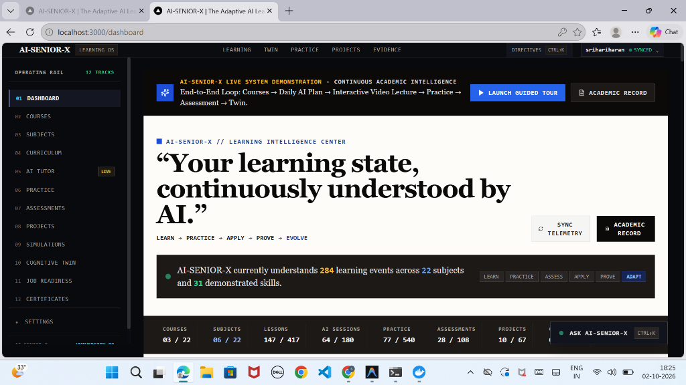
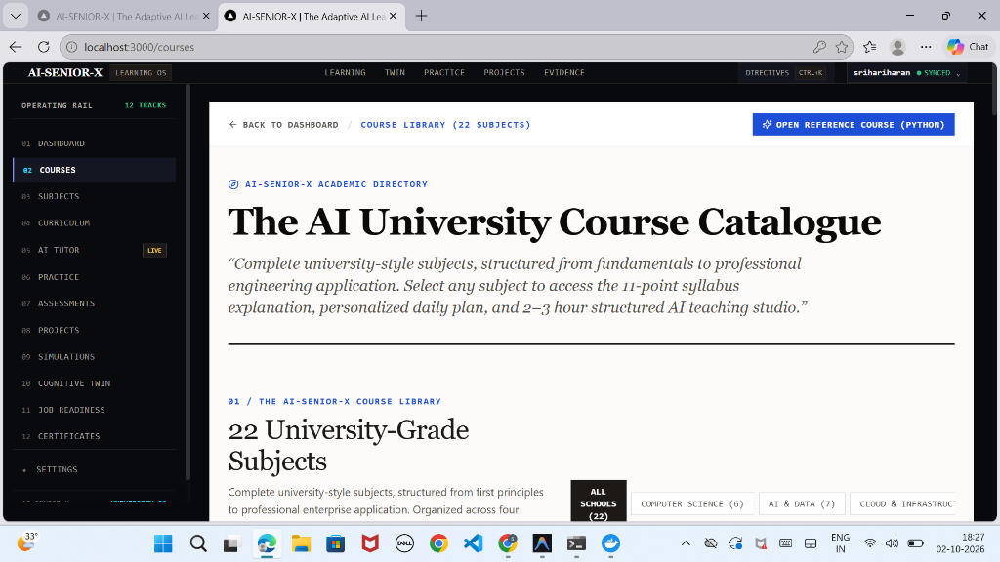
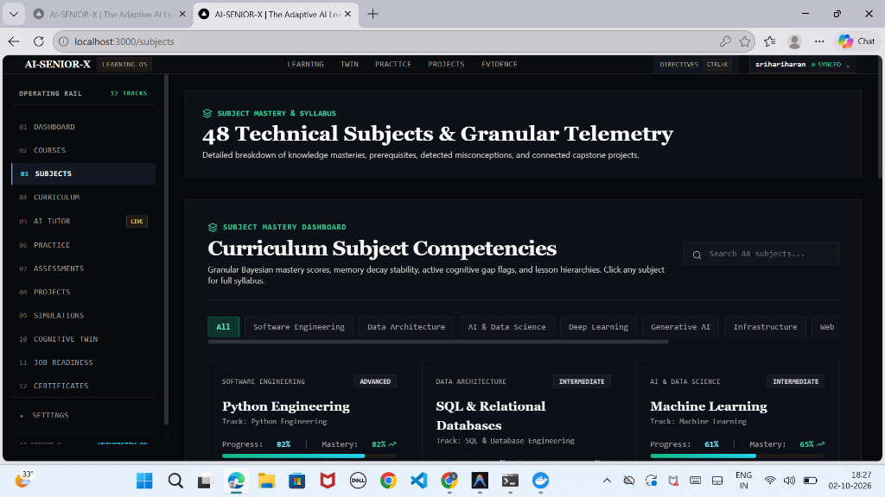
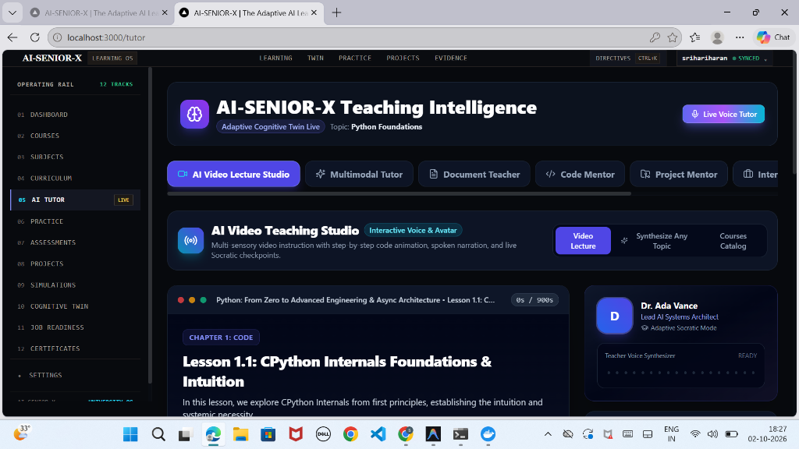
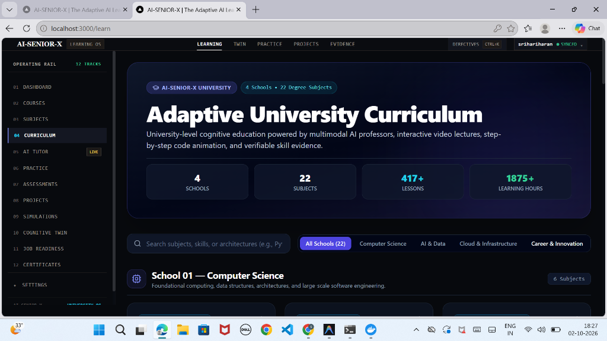

<div align="center">

# 🏛️ AI-SENIOR-X
### **The Autonomous AI University & Continuous Learning Intelligence Center**

[](https://www.python.org/)
[](https://fastapi.tiangolo.com/)
[-black.svg?logo=next.js&logoColor=white)](https://nextjs.org/)
[](https://www.typescriptlang.org/)
[](https://www.postgresql.org/)
[-2496ED.svg?logo=docker&logoColor=white)](https://www.docker.com/)
[](https://pytest.org/)
[-black.svg)](https://github.com/astral-sh/ruff)
[](https://opensource.org/licenses/MIT)

<p align="center">
  <strong>"Your learning state, continuously understood by AI."</strong><br>
  <em>Learn &rarr; Practice &rarr; Apply &rarr; Prove &rarr; Evolve</em>
</p>

[Project Overview](#-project-overview) • [Technologies Used](#-technologies-used) • [Live Showcase](#-live-platform-showcase) • [Architecture](#-system-architecture) • [Setup & Installation](#-setup--installation) • [How to Run](#-how-to-run-the-project) • [API Specs](#-api-specification)

---

</div>

<p align="center">
  
</p>

---

## 📖 Project Overview

**AI-SENIOR-X** is an **Autonomous AI University Operating System & Continuous Learning Intelligence Center**. 

Rather than serving passive video playlists or acting as a generic conversational chatbot, AI-SENIOR-X maintains an active, event-sourced **Cognitive Learning Twin** that maps every concept studied, practice mistake, diagnostic assessment, and verified capstone project across **4 Schools and 22 Academic Subjects**.

### 🌟 Core Capabilities & Differentiators

- **🏛️ Live Academic Intelligence Center**: Real-time status bar tracking Enrolled Courses, Subjects, Lessons, AI Video Hours, Practice Solved, Assessments, and Verified Certificates.
- **🧬 Continuous Cognitive Learning Twin**: Uses Bayesian Knowledge Tracing (BKT) and memory decay modeling to track mastery across 4 cognitive quadrants (*Known, Developing, Needs Practice, Ready For*).
- **🎙️ 2–3h AI Video Teaching Studio**: Interactive multi-chapter video lectures with live checkpoints, pause-and-ask socratic dialogues, and multi-language voice narration (English, Tamil, Hindi).
- **📚 Integrated Subject Materials Hub**: Dynamic indexing connecting lecture notes, video studio transcripts, runnable Python/JS code sandboxes, interactive quizzes, exercises, and knowledge base documents with grounded RAG AI tutor Q&A.
- **🧠 Feynman Teach-Back Engine**: Evaluates the learner's written/spoken conceptual explanations to diagnose mental model gaps and subtle misconceptions.
- **🛡️ Evidence-Grounded Mastery**: No arbitrary percentage bars. Mastery is categorized into **5 discrete states** (*Not Started, Learning, Practicing, Assessment, Demonstrated, Mastered*) backed by cryptographic SHA-256 evidence tokens.
- **🤖 Multi-Agent Orchestration**: Specialized micro-agents (*Master Orchestrator, Socratic Tutor, Evaluator & Grading, Misconception Radar, Recovery Engine, Next-Best-Action Recommender*).

---

## 🛠️ Technologies Used

| Layer | Technology / Framework | Purpose |
|---|---|---|
| **Frontend Framework** | **Next.js 14.2 (App Router)** | Modern server-side rendered and dynamic React architecture |
| **Frontend Language** | **TypeScript 5.0+** | Strict end-to-end type safety |
| **Styling & Design** | **Tailwind CSS + Glassmorphic Design System** | High-density typography, academic dark theme, responsive layouts |
| **Backend Framework** | **FastAPI 0.115+ (Async Python 3.11+)** | High-performance asynchronous API gateway and micro-services |
| **Database & ORM** | **PostgreSQL 16 + asyncpg + SQLAlchemy 2.0** | Scalable relational storage, transaction isolation & migrations |
| **Vector Engine / RAG** | **pgvector / In-Memory Embedding Cache** | Semantic vector search, hybrid retrieval, and grounded RAG citations |
| **Authentication** | **PyJWT (RS256/HS256) + Native Bcrypt** | Secure stateless authentication, password hashing, and token refresh |
| **AI / Multi-Agent Engine** | **Google Gemini 2.0 / OpenAI GPT-4o / Local Fallback** | Multi-agent socratic dialogue, dynamic exercise generation, code mentoring |
| **Containerization** | **Docker & Docker Compose (Multi-stage)** | Production-ready isolated container deployment |
| **Quality & Tooling** | **Pytest (136 tests) + Ruff + Mypy** | Automated testing, linting, formatting, and strict type verification |

---

## 📸 Live Platform Showcase

<div align="center">

### 1. 🏛️ The Academic Intelligence Center

<p><em>Real-time Bayesian telemetry tracking 284 learning events across 22 degree subjects with evidence verification pipeline.</em></p>

<br/>

### 2. 🎓 University Course Catalogue (22 Degree Subjects)

<p><em>4 specialized schools spanning Computer Science, AI & Data, Cloud Infrastructure, and Career Innovation.</em></p>

<br/>

### 3. 📊 Subject Competencies & Granular Telemetry

<p><em>Granular Bayesian mastery scores, memory decay modeling, active cognitive gap flags, and connected capstone projects.</em></p>

<br/>

### 4. 🎙️ AI Video Teaching Studio & Multi-Agent Intelligence

<p><em>Multi-chapter video lectures with live checkpoints, pause-and-ask socratic dialogues, and multi-language voice narration.</em></p>

<br/>

### 5. 🗺️ Adaptive University Curriculum Matrix

<p><em>4 Schools, 22 Subjects, 417+ Lessons, and 1,875+ verifiable learning hours structured from first principles to production mastery.</em></p>

</div>

---

## 🏗️ System Architecture

<p align="center">
  
</p>

### End-to-End Execution Flow

```mermaid
flowchart TD
    subgraph UI[Academic Operating System (Next.js 14)]
        DASH[Learning Intelligence Center]
        STUDIO[2-3h AI Video Teaching Studio]
        TEACHBACK[Feynman Teach-Back Engine]
        MAT[Subject Materials Library]
        PRAC[Adaptive Practice & AST Ide]
        EXAM[Diagnostic Assessments]
        CHAL[Enterprise Capstone Quests]
    end

    subgraph GATEWAY[FastAPI Application Gateway]
        AUTH[JWT Security & Native Bcrypt]
        AGG[Dashboard Analytics Service]
        MAT_SRV[Subject Material Indexing Service]
        TWIN_SRV[Cognitive Twin Aggregator]
    end

    subgraph AGENTS[Multi-Agent Orchestration Engine]
        ORCH[Master Pedagogical Orchestrator]
        TUTOR[Socratic Tutor Agent]
        EVAL[Evaluator & Grading Agent]
        RADAR[Misconception Radar Agent]
        RECOVER[Failure-to-Recovery Engine]
        REC[Next-Best-Action Recommender]
    end

    subgraph CURRICULUM[University Knowledge Graph]
        CS[School 01: Computer Science & Systems]
        AI[School 02: AI & Data Science]
        CLOUD[School 03: Cloud & DevOps]
        CAREER[School 04: Career & Leadership]
    end

    subgraph STORAGE[Data & Memory Layer]
        PG[(PostgreSQL 16 & PGVector)]
        SQLITE[(Local SQLite zero-config)]
        KB[(Knowledge Base & Vector Store)]
        TWIN_STATE[(Bayesian BKT Cognitive Profiles)]
    end

    DASH --> AGG
    STUDIO --> TUTOR
    TEACHBACK --> EVAL
    MAT --> MAT_SRV
    PRAC --> EVAL
    EXAM --> EVAL
    CHAL --> RADAR

    AGG --> GATEWAY
    MAT_SRV --> KB
    GATEWAY --> ORCH
    ORCH --> AGENTS
    AGENTS --> CURRICULUM
    AGENTS --> STORAGE
```

---

## 🏛️ 4 Schools & 22 University Disciplines

| School | Subjects Included | Focus & Core Modules |
|---|---|---|
| **💻 01. Computer Science & Software Systems** | • Python Engineering<br>• Data Structures & Algorithms<br>• Software Engineering<br>• Relational Databases & SQL<br>• Modern Web Development<br>• System Design & Scalability | AsyncIO, Metaprogramming, Memory Layouts, CTEs, Window Functions, Microservices |
| **🧠 02. Artificial Intelligence & Data Science** | • AI & Machine Learning<br>• Deep Learning & Neural Nets<br>• Generative AI & LLMs<br>• Data Science Foundations<br>• Data Analytics & Insights<br>• Mathematics for ML<br>• Statistics & Probabilistic Modeling | Loss Curves, Gradient Descent, Vector Embeddings, RAG Architectures, XGBoost |
| **☁️ 03. Cloud, DevOps & Infrastructure** | • Cloud Architecture (AWS/GCP)<br>• DevOps & CI/CD Pipelines<br>• MLOps & Production AI<br>• Cybersecurity & Threat Modeling | Kubernetes Ingress, Terraform, VPC Peering, Multi-stage Docker Containerization |
| **🚀 04. Leadership, Innovation & Career** | • Professional Communication<br>• Technical Interview Prep<br>• Entrepreneurship & Venture<br>• Product Management<br>• UI/UX Design & Human-AI Interaction | Executive Briefings, System Design Interviews, Product Metrics, User Journeys |

---

## ⚙️ Setup & Installation

### System Prerequisites

- **Python**: `>= 3.11` (Python 3.11, 3.12, or 3.13)
- **Node.js**: `>= 18.17.0` (Node 20 LTS recommended)
- **Git**: Latest version
- **Docker & Docker Compose**: (Optional, for containerized execution)

---

### Step 1: Clone the Repository

```bash
git clone https://github.com/srihariharan534/AI-SENIOR-X.git
cd AI-SENIOR-X
```

---

### Step 2: Backend Setup & Installation

```bash
# 1. Create a Python virtual environment
python -m venv venv

# 2. Activate the virtual environment
# Windows (PowerShell):
.\venv\Scripts\Activate.ps1
# Linux / macOS:
source venv/bin/activate

# 3. Upgrade pip and install all backend dependencies
pip install --upgrade pip
pip install -e ".[dev]"
```

---

### Step 3: Frontend Setup & Installation

```bash
# 1. Navigate to frontend directory
cd frontend

# 2. Install all Node.js dependencies
npm install

# 3. Return to project root
cd ..
```

---

### Step 4: Configure Environment Variables

```bash
# Copy example environment configuration
cp .env.example .env
```
*(Default settings automatically work out of the box with local SQLite/Postgres and mock/Gemini providers).*

---

## 🚀 How to Run the Project

You can run **AI-SENIOR-X** either **Locally (Recommended for development)** or using **Docker Compose**.

### Option A: Local Development Mode (Fastest)

Open two terminal windows:

#### Terminal 1 — Backend (FastAPI Engine):
```powershell
# From the project root
uvicorn backend.app.main:app --host 127.0.0.1 --port 8000 --reload
```
- **API Swagger Docs**: [http://127.0.0.1:8000/docs](http://127.0.0.1:8000/docs)
- **API Health Check**: [http://127.0.0.1:8000/api/v1/health](http://127.0.0.1:8000/api/v1/health)

#### Terminal 2 — Frontend (Next.js 14):
```powershell
# Navigate to frontend folder
cd frontend
npm run dev
```
- **Academic Intelligence Center**: [http://localhost:3000/dashboard](http://localhost:3000/dashboard)
- **User Registration**: [http://localhost:3000/register](http://localhost:3000/register)
- **University Course Library**: [http://localhost:3000/courses](http://localhost:3000/courses)
- **Interactive AI Tutor**: [http://localhost:3000/tutor](http://localhost:3000/tutor)

---

### Option B: Docker Containerized Mode

Run the entire multi-container stack (PostgreSQL 16, FastAPI Backend, Next.js Frontend) with a single command:

```powershell
# 1. Build and start all services in the background
docker compose up -d --build

# 2. Check running container health
docker compose ps

# 3. View live streaming logs
docker compose logs -f

# 4. Stop all services
docker compose down
```

| Service | Container Name | Status | Local URL |
| :--- | :--- | :--- | :--- |
| **Frontend** | `ai_senior_x_frontend` | 🟢 Healthy | [http://localhost:3000](http://localhost:3000) |
| **Backend API** | `ai_senior_x_backend` | 🟢 Healthy | [http://localhost:8000/docs](http://localhost:8000/docs) |
| **PostgreSQL** | `ai_senior_x_postgres` | 🟢 Healthy | `localhost:5432` |

---

## 🧪 Testing & Code Quality

AI-SENIOR-X enforces strict code quality gates and maintains **100% test pass rate**:

```powershell
# 1. Run full Pytest suite (136 unit & integration tests)
python -m pytest backend/tests -v

# 2. Run test suite with coverage report (81%+ coverage)
python -m pytest backend/tests -v --cov=backend/app --cov-report=term-missing

# 3. Run Ruff fast linter
python -m ruff check backend

# 4. Run Ruff formatter check
python -m ruff format --check backend

# 5. Run Mypy static type checker
python -m mypy backend/app

# 6. Validate Next.js production build (33 routes verified)
cd frontend
npm run build
cd ..
```

---

## 🔌 API Specification

All API endpoints return structured, type-safe JSON responses:

| Method | Endpoint | Description |
|---|---|---|
| `GET` | `/api/v1/dashboard/overview` | Aggregated Live Academic Intelligence Center status & telemetry |
| `GET` | `/api/v1/materials/subjects/{subject_id}` | Complete indexed subject materials library |
| `GET` | `/api/v1/materials/{material_id}` | Detailed content, worked code, and metadata for a material |
| `POST` | `/api/v1/materials/{material_id}/ask-ai` | Grounded RAG AI tutor explanation without hallucination |
| `GET` | `/api/v1/university/schools` | 4 Schools and 22 Academic Degree Disciplines |
| `GET` | `/api/v1/university/courses/{course_id}` | Curriculum hierarchy (modules, chapters, and lessons) |
| `POST` | `/api/v1/university/teach-back` | Feynman Teach-Back evaluation and misconception scoring |
| `POST` | `/api/v1/certificates/generate` | Cryptographically attested SHA-256 verifiable certificate |
| `GET` | `/api/v1/health` | System health check & database latency |

---

## 📜 License

This project is licensed under the **MIT License** — see the [LICENSE](LICENSE) file for details.

---

<div align="center">

**AI-SENIOR-X — The Autonomous AI University Operating System**  
*Empowering engineers to master complex domains through evidence, not assumptions.*

</div>
