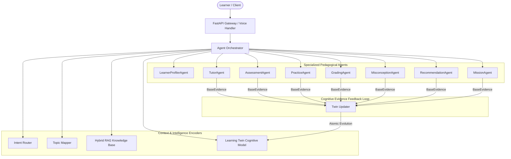

# AI-SENIOR-X Multi-Agent System Architecture

## 1. System Overview

AI-SENIOR-X features a collaborative multi-agent educational architecture where specialized pedagogical agents coordinate around a unified **Learning Twin** cognitive model, shared curriculum graph, and hybrid RAG knowledge base.



---

## 2. Specialized Agents

| Agent Name | Primary Responsibility | Input Schemas | Emitted Evidence | Next Suggested Actions |
|---|---|---|---|---|
| **LearnerProfilerAgent** | Cognitive profiling, learning pace, modality inference, goal tracking | Goals, onboarding info, interaction history | `FeedbackEvidence` | `RECOMMEND`, `LEARN` |
| **TutorAgent** | Socratic & direct conceptual instruction, code walkthroughs, real-world analogies | Learner profile, RAG context, active misconceptions | `TutorEvidence` | `PRACTICE`, `ASK` |
| **AssessmentAgent** | Adaptive diagnostic & formative quiz generation, item distractor modeling | Target concepts, current mastery, difficulty calibration | `AssessmentEvidence` | `GRADE` |
| **PracticeAgent** | Interactive coding challenges, debugging tasks, algorithmic drills | Mastery gaps, weak concepts, target misconception | `PracticeEvidence` | `GRADE` |
| **GradingAgent** | Hybrid evaluation (deterministic exact/regex for MCQs, LLM rubric for short answers) | Question, rubric, learner submission, distractor map | `AssessmentEvidence`, `MisconceptionEvidence` | `PRACTICE`, `RECOMMEND` |
| **MisconceptionAgent** | Root-cause diagnostic analysis, misconception detection, counterexamples | Incorrect answers, conversational confusion queries | `MisconceptionEvidence` | `PRACTICE` |
| **RecommendationAgent** | Explainable next-best-lesson ranking, review prioritization, prerequisite resolution | Knowledge map, overdue reviews, active misconceptions | `FeedbackEvidence` | `LEARN`, `REVIEW`, `REMEDIATE` |
| **MissionAgent** | Gamified learning missions, quest milestones, reward points, capstone bounties | Focus topic, difficulty tier, learner achievements | `CompletionEvidence` | `LEARN` |

---

## 3. Agent Message Protocol

All specialized agents implement the unified typed message contract:

```python
class AgentRequest(BaseModel):
    request_id: str
    learner_id: str
    session_id: str | None
    intent: str
    query: str
    topic_id: str | None
    concept_id: str | None
    subject: str | None
    learner_context: dict[str, Any]
    curriculum_context: dict[str, Any]
    rag_context: str | None
    payload: dict[str, Any]
    language: str


class AgentResponse(BaseModel):
    request_id: str
    agent_name: str
    status: str
    result: dict[str, Any]
    content: str
    evidence: list[BaseEvidence]
    confidence: float
    next_suggested_action: str | None
    metadata: dict[str, Any]
```

---

## 4. Orchestration & Routing

The `IntentRouter` classifies learner intent using deterministic regex patterns across 13 intent categories (`LEARN`, `ASK`, `EXPLAIN`, `PRACTICE`, `ASSESS`, `GRADE`, `REVIEW`, `MISCONCEPTION`, `RECOMMEND`, `MISSION`, `PROGRESS`, `EXAM`, `VOICE`), falling back to conversational tutoring for unstructured inquiries.

---

## 5. Pedagogy & Cognitive Feedback Loop

Every meaningful learning interaction emits polymorphic learning evidence (`AssessmentEvidence`, `PracticeEvidence`, `TutorEvidence`, `CompletionEvidence`, `MisconceptionEvidence`, `FeedbackEvidence`).
The `TwinUpdater` processes evidence atomically:
1. Recalculates multi-factor Bayesian concept mastery.
2. Synchronizes skill graph dependencies.
3. Tracks detected misconceptions and resolutions.
4. Schedules spaced repetition intervals via modified SM-2.
5. Emits real-time state for next-action recommendation.
