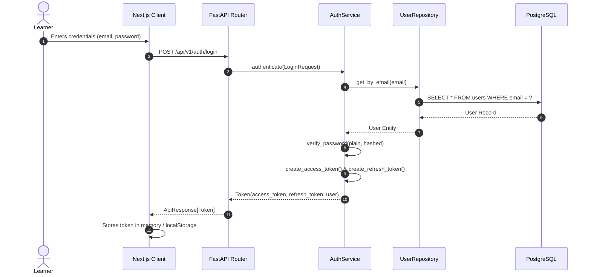
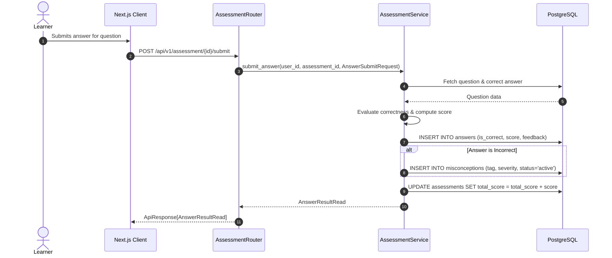
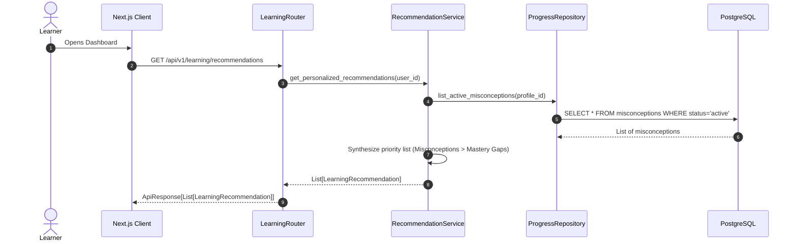

# AI-SENIOR-X Data Flow Architecture

## 1. Authentication & Session Flow

---

## 2. Assessment Submission & Misconception Detection Flow

---

## 3. Learning Pathways & Recommendation Retrieval Flow

