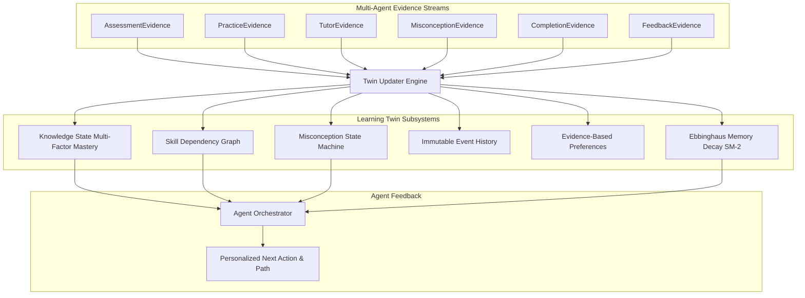

# AI-SENIOR-X Cognitive Learning Twin Architecture

## 1. Overview

The **Learning Twin** is a dynamic, high-fidelity cognitive model of the learner's knowledge, skills, misconceptions, retention decay, and evidence-based preferences.

It acts as the single source of educational truth consumed by all specialized agents (`TutorAgent`, `AssessmentAgent`, `PracticeAgent`, `GradingAgent`, `MisconceptionAgent`, `RecommendationAgent`, `MissionAgent`, `LearnerProfilerAgent`).

---

## 2. Evidence Ingestion & Cognitive Updating

Every agent emits typed `BaseEvidence` records:

1. **Assessment Evidence**: Updates concept mastery using Bayesian adjustment taking into account question difficulty, answer correctness, and response latency.
2. **Practice Evidence**: Updates attempt counts, successful code completion signals, and hint usage.
3. **Tutor Evidence**: Records turn engagement, comprehension sentiment, and topic exposure.
4. **Misconception Evidence**: Activates or updates misconception confidence, severity, and detection counts.
5. **Completion Evidence**: Records quest completion, XP awards, and module milestones.
6. **Feedback Evidence**: Tracks self-reported confidence and modality preferences.

---

## 3. Multi-Factor Concept Mastery

Concept mastery scores $\in [0.0, 1.0]$ are categorized into standard mastery levels:
- **Unknown** ($< 0.20$)
- **Learning** ($0.20 - 0.49$)
- **Developing** ($0.50 - 0.69$)
- **Proficient** ($0.70 - 0.89$)
- **Mastered** ($\ge 0.90$)

---

## 4. Retention & Spaced Repetition (Modified SM-2)

The `MemoryDecayModel` and `SpacedRepetitionScheduler` track review intervals and stability:
- Successful reviews increment repetitions and compute next intervals according to the easiness factor ($EF \ge 1.3$).
- Forgotten items reset repetitions to 1-day urgency drills.
- Overdue reviews are prioritized automatically by the `RecommendationAgent`.
