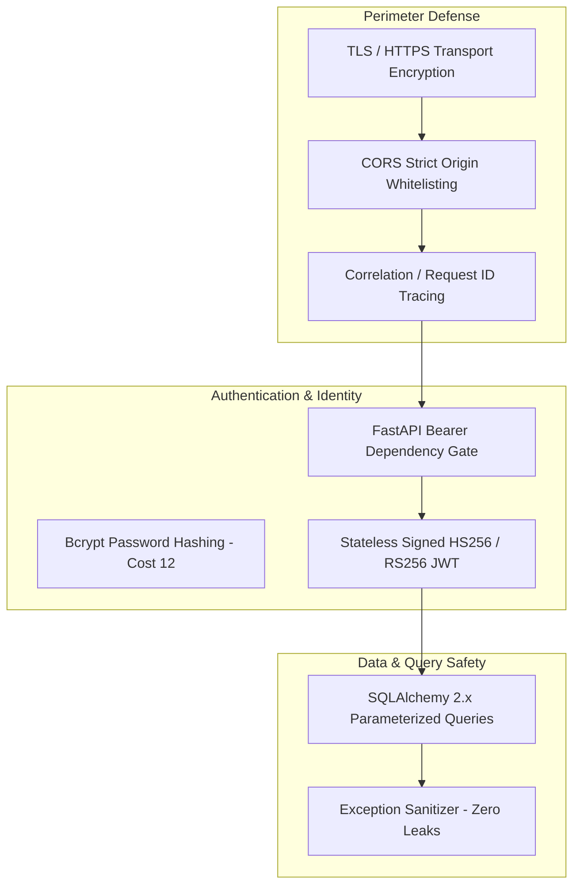

# AI-SENIOR-X Security Architecture

## 1. Security Overview

AI-SENIOR-X adheres to strict defense-in-depth security principles across transport, authentication, authorization, data persistence, and error sanitization.

---

## 2. Core Security Controls



---

## 3. Security Specifications

### 1. Password Management
* Passwords are never stored or logged in plain text.
* Hashing utilizes `passlib` with the `bcrypt` algorithm.
* Passwords require minimum 8 characters upon registration.

### 2. JWT Authentication
* Access tokens are signed using `HS256` with a configured minimum 256-bit `SECRET_KEY`.
* Default access token lifespan is 60 minutes.
* Refresh tokens are stored securely and separate from access credentials.

### 3. Protection Against Injection
* All database transactions are executed through SQLAlchemy 2.0 ORM query builders and parameterized bindings, neutralizing SQL injection vectors.
* Input validation is enforced at the gateway boundary through Pydantic v2 schemas.

### 4. Safe Error Translation
* Internal exceptions, stack traces, and database connection strings are masked by custom FastAPI global exception handlers.
* Clients receive safe, structured error objects:
  ```json
  {
    "success": false,
    "error": {
      "code": "AUTHENTICATION_FAILED",
      "message": "Invalid email or password.",
      "details": {}
    }
  }
  ```

### 5. CORS and Header Protection
* Configurable `CORS_ORIGINS` restrict cross-origin requests to authorized origins.
* Response headers include `X-Request-ID` and `X-Process-Time-Ms` for auditing without leaking infrastructure details.
