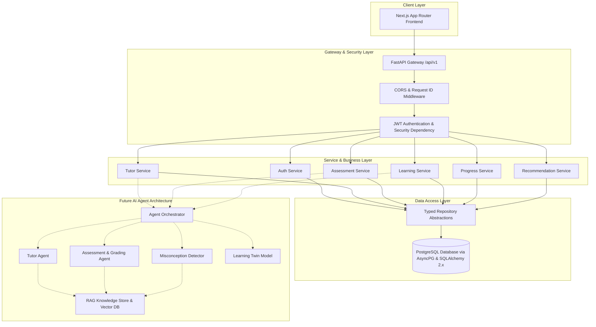

# AI-SENIOR-X System Architecture

## 1. Architectural Philosophy

AI-SENIOR-X is architected around principles of **domain separation, asynchronous scalability, strong type contracts, and multi-agent AI extensibility**.

---

## 2. Layered Architecture

---

## 3. Component Boundaries

### Implemented Foundation (Master Prompt 1)

1. **FastAPI Application Gateway**:
   - Centralized Pydantic configuration (`core/config.py`).
   - Unified API response wrapping (`ApiResponse[T]`).
   - Exception filtering with safe error translation.
   - Structured JSON logging and metrics collector.

2. **Database & Data Access**:
   - PostgreSQL 16+ engine with AsyncPG connection pool.
   - 8 normalized ORM models: `User`, `LearnerProfile`, `LearningSession`, `Assessment`, `Question`, `Answer`, `Misconception`, `Progress`.
   - Strong repository patterns isolating persistence logic.
   - Alembic migration versioning.

3. **Security**:
   - Bcrypt password hashing.
   - JWT token lifecycle with Bearer auth dependency injection.

4. **Client Interface**:
   - Next.js 14 App router with clean design tokens, dark glassmorphism, responsive navigation, and typed API abstraction.

### Implemented AI Intelligence Layer (Master Prompt 2)

```mermaid
graph TD
    subgraph LLM Provider Layer
        P1[Provider Abstraction BaseLLMProvider]
        P2[GeminiProvider]
        P3[OpenAIProvider]
        P4[MockLLMProvider]
        SO[StructuredOutputEngine with JSON Repair]
        PM[PromptManager & Versioned Templates]
        P1 --> P2 & P3 & P4
        P1 --> SO
        PM --> P1
    end

    subgraph Hybrid RAG Knowledge Base
        DL[DocumentLoader & Cleaner]
        DC[Semantic Chunker]
        EMB[EmbeddingEngine Gemini / Deterministic]
        VS[LocalVectorStore Cosine Similarity]
        HS[HybridSearcher Dense + BM25]
        RR[CrossRelevanceReranker]
        CB[RAG ContextBuilder with Citations]
        DL --> DC --> EMB --> VS
        VS --> HS --> RR --> CB
    end

    subgraph Curriculum Engine
        CG[Curriculum DAG Graph 9 Domains]
        PE[Prerequisite Engine & Readiness Diagnoser]
        TM[Natural Language Topic Mapper]
        CG --> PE
        CG --> TM
    end

    subgraph Learning Twin Cognitive System
        EV[Standardized Evidence Ingestion]
        TU[Twin Updater & Bayesian Evolution]
        KS[Multi-Factor Knowledge State]
        SG[Skill Dependency Graph]
        MS[Misconception State Lifecycle]
        LH[Immutable Learning History]
        PR[Evidence-Based Preferences]
        DM[Ebbinghaus Memory Decay & Review Spaced Repetition]
        EV --> TU
        TU --> KS & SG & MS & LH & PR
        KS & SG --> DM
    end
```

1. **Multi-Model LLM Abstraction**:
   - `BaseLLMProvider` decoupling backend from specific inference APIs.
   - `StructuredOutputEngine`: Self-correcting schema validator with Markdown fence stripping, brace matching, syntax repair, and Pydantic validation.
   - `PromptManager`: Parameterized template loader with safety boundaries for tutoring, assessments, grading, misconceptions, and recommendations.

2. **High-Accuracy RAG Subsystem**:
   - Ingestion pipeline with semantic chunking and deterministic MD5 UUID chunk tracking.
   - Batch-capable embedding providers with in-memory caching.
   - Hybrid retrieval combining dense vector similarity with sparse BM25 lexical token matching.
   - Cross-relevance reranker scoring candidates across lexical overlap, recency, and domain priors.
   - Prompt-safe context packaging treating retrieved data as passive context rather than active instructions.

3. **Curriculum Knowledge Graph**:
   - Direct Acyclic Graph (DAG) covering 9 domains (AI/ML, Python, Data Science, Math, Statistics, SQL, DSA, Cloud, Web Dev).
   - Graph traversal supporting topological sorting, ancestor prerequisite trees, and readiness gap analysis.
   - Semantic NLP topic mapper matching learner queries to precise curriculum concepts.

4. **Learning Twin Cognitive Modeling**:
   - Multi-factor mastery algorithm incorporating accuracy, question difficulty, consistency, and response latency.
   - Ebbinghaus memory decay modeling with spaced repetition urgency scoring.
   - Skill graph synchronization with prerequisite deficiency warnings.
   - Misconception state machine tracking detection, confidence, and resolution.
   - Universal learning evidence ingestion interface preparing for Master Prompt 3 specialized AI agents.

### Future Components (Master Prompt 3)

1. **Autonomous Agent Orchestration**: Multi-turn pedagogical reasoning, reflection loops, and agent collaboration (Tutor Agent, Assessment Agent, Practice Agent, Grading Agent, Misconception Agent, Mission Agent).
2. **Real-Time Voice and Multimodal Interaction**: Live audio streaming and vision diagram analysis.
